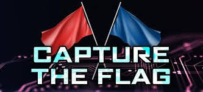

# Capture The Flag (CTF)

  

## Português:
Captura à bandeira (também chamadas de Capture The Flag ou CTF) são competições de segurança cibernética e de hacking ético que exploram diferentes meios da computação envolvendo a área de cybersegurança. Esse repositório foi criado para
eu poder depositar todo o conteúdo que eu ache importante em relação a essas competições de hackers. 

IMPORTANTE: Esse repositório será atualizado de tempos em tempos, conforme eu for resolvendo mais e mais exercícios presentes nas plataformas, a fim de eu melhorar cada vez mais minhas habilidades no meio da programação. Então, isso 
é um projeto duradouro que pretendo levar até o fim da minha graduação em Ciência da Computação. 

[Meu perfil da plataforma TryHackMe](https://tryhackme.com/p/Antonio.R.F)

  

## English:
Capture de Flag (or CTF) competitions are cibersecurity and ethical hacking that explore different areas of computing, specifically in the field of cybersecurity. This repository was created to store all the content I find importante
about this hackers competitions.

IMPORTANT: This repository will be updated from time to time as I solve more and more exercises available on the platforms, aiming to continuously improve my programming skills.
Therefore, this is a long-term project that I intend to maintain until the end of my Computer Science degree.

[My profile of TryHackMe platform](https://tryhackme.com/p/Antonio.R.F)

